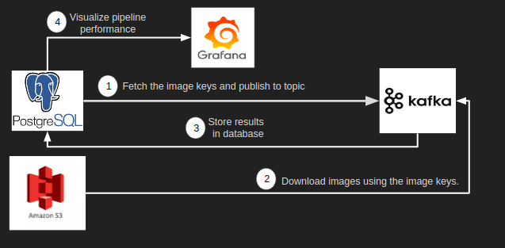

# VisionScaling

The project shows a pipeline for recognizing images in real time. It simulates streaming using Kafka and classifies image in real time.

The presentation link can be found [here](https://docs.google.com/presentation/d/1AXTj4XnN3J07t_TvsdBeXB4pNT_Kj0cNsFCqiK6HjQo/edit?usp=sharing).

The demo of the UI can be found [here](https://drive.google.com/file/d/1p6be5DqKEEJNd4OUQgZcsqx8HiPI3gm0/view?usp=sharing).

### Cluster Setup Instructions

There are 3 nodes in the cluster where 1 node acts as a Producer and the rest 2 acts as a Consumer.

The following things are need to be installed on each of the nodes in the cluster.

1. Java 8

	`sudo apt-get install openjdk-8-jdk`

2. Confluent Kafka

	The tutorial for installing confluent Kafka can be found [here](https://docs.confluent.io/current/installation/installing_cp/deb-ubuntu.html#systemd-ubuntu-debian-install)

3. Python library for confluent kafka

	`pip3 install confluent-kafka`

4. Pytorch for executing Deep Learning model
	
	`pip3 install torch==1.6.0+cpu torchvision==0.7.0+cpu -f https://download.pytorch.org/whl/torch_stable.html`

5. Faust for stream processing on Consumer Nodes
	
	`pip3 install -U faust`

6. psycopg2 - Python library for interacting with PostgreSQL database

	`pip3 install psycopg2`

7. boto3 - Python library for interacting with AWS EC2 and S3.

	`pip3 install boto3`

### Database Instructions

PostgreSQL is used for storing the image keys for each image in S3. Image keys here refer to the string which is used to access the image files from S3. Also, the results from the Deep Learning model are stored in PostgreSQL.

There is one database called my_db and there are two tables in the database.

1) image_info

| image_key |
|-----------|

2) prediction_results

| image_key | category | confidence | hostname | time |
|-----------|----------|------------|----------|------|

### Introduction

##### What exactly does this project do?
This project simulates the streaming application. It fetches image keys from PostgreSQL, passes them as stream through Kafka cluster which further downloads images from S3, runs the inference using SqueezeNet model and writes the output back into PostgreSQL.

There are images stored in S3 and their corresponding image_keys in PostgreSQL. This was achieved through upload.py script. The Producer will fetch those image keys from PostgreSQL and publish them to Kafka topic across 3 partitions. The Consumer nodes will fetch those image keys from those partitions, downloads the image keys from S3, runs the inference using SqueezeNet model and writes the result to PostgreSQL.

##### Where does this project prove useful?
For companies having their warehouses store and organize their products, this pipeline helps in the automation of that process.

As seen in the above picture, that the robot is trying to organize the objects based on color. Similarly, using the images, this pipeline helps in organizing the objects into different bins based on the category it belongs to. For eg, in a manufacturing industry, organizing parts of the machine based on its type. Is it a general purpose part?, Is it specific to machine A? and so on. In a warehouse, there are multiple such belts that are carrying objects which creates the need for producing results within seconds or even less.

##### How would this work in a real world scenario?
For the real world applications, the incoming images will be stored in S3 and their respective image keys will directly be streamed to Kafka topic. The rest of the pipeline remains the same which includes downloading, running the prediction model and writing the output to the database. The difference will be that the image keys will not be stored in PostgreSQl and directly streamed to Kafka cluster.

### Architecture

The architecture contains the following components:

1. **S3**: This is used to store the image files.
2. **PostgreSQL**: The image keys which are used for accessing image files from S3 are stored in PostgreSQL. Additionally, the results produced from the Consumer are stored here.
3. **Kafka Cluster**: This is the main processing part. There are 3 nodes in the cluster - 1 Producer and 2 Consumers.
	1. *Producer*: It fetches the image keys from PostgreSQL and publishes to the Kafka topic.
	2. *Consumer*: It consumes image keys from the Kafka topic, downloads the corresponding image files from S3, runs the inferences using SqueezeNet model and stores the result back to PostgreSQL.
4. **Faust**: It is a Python stream processing library that is used to process Kafka streams on the Consumer. It is highly available, distributed and flexible that works with various Python libraries.

Here is the pipeline diagram:

### Dataset
The dataset being used is ImageNet Large Scale Visual Recognition Challenge 2017 (ILSVRC2017). It is around 55GB in size and has images across 1000 different categories. The dataset can be found [here](http://image-net.org/challenges/LSVRC/2017/downloads).
